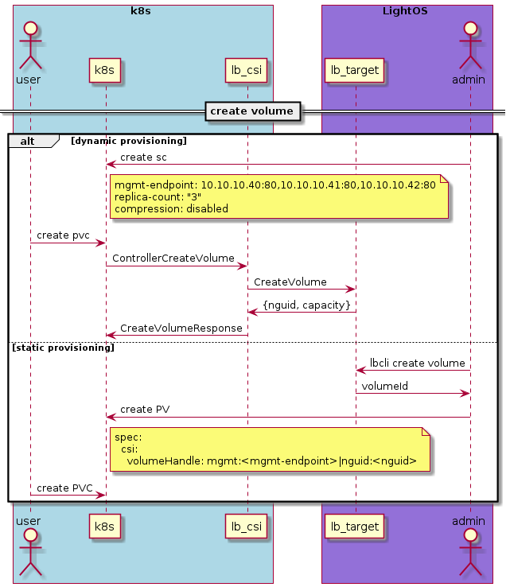
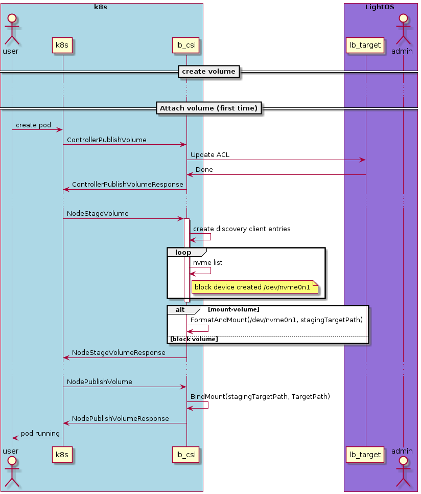
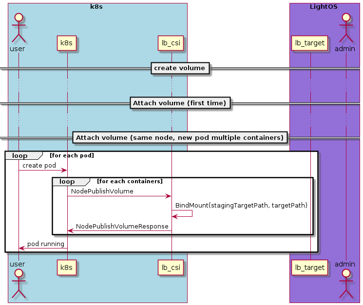
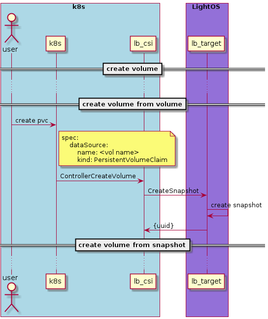

# Design and architecture

- [Design and architecture](#design-and-architecture)
  - [Architecture and Operation](#architecture-and-operation)
    - [Provisioning Storage](#provisioning-storage)
  - [Driver Components](#driver-components)
    - [Identity Service](#identity-service)
    - [Controller Service](#controller-service)
    - [Node Service](#node-service)
  - [Flows and Use-cases](#flows-and-use-cases)
    - [Volume Creation](#volume-creation)
    - [Volume Attach](#volume-attach)
    - [Snapshots and Clones](#snapshots-and-clones)

## Architecture and Operation

The Lightbits Labs™ LightOS® storage solution is a disaggregated flash platform for cloud and data center infrastructures with a software-only or software with hardware acceleration solution. It delivers high performance and consistently low latency based on multi NVMe SSD management and NVMe over TCP (NVMe/TCP) storage communication protocol.

The following diagram illustrates the LightOS integration in a Kubernetes cluster:


The CSI driver connects the CO (Kubernetes in this case) to the backend storage cluster over a standard TCP/IP network – Kubernetes PVs/PVCs creation trigger the CSI driver operations to interact with the storage cluster via the control plane REST API server, after which an NVMe/TCP connection is established resulting with an nvme block device at the compute node, which can then be formatted and mounted by a filesystem (or used as-is), finally to be used by stateful applications.

### Provisioning Storage

Static provisioning allows system administrators to manually provision volumes to be later used by applications running in the compute cluster (Kubernetes).
Dynamic provisioning allows k8s users to create a SC (storageClass) which is used later by PVCs to connect to the CSI plugin and dynamically create volumes.
In both cases, once a POD is created, the CO triggers a CSI gRPC call to the plugin requesting to

1.	Publish the volume to a specific node by updating the ACL (Access Control List)
2.	Attach the volume to that node
3.	Publish the attached volume to a container

## Driver Components

The Lightbits CSI plugin implements all mandatory CSI services:

- Controller service
- Identity service
- Node service

### Identity Service

The identity service runs on every node, and implements the following RPCs:

-	`GetPluginCapabilities` – Returns the mandatory controller service capability
-	`GetPluginInfo` – Returns the plugin name (csi.lightbits.com) and the plugin version
-	`Probe` – always returns true in the probe response

### Controller Service

The controller service runs on one of the cluster nodes, and implements the following RPCs:

-	`CreateVolume` – Creates the volume in the LB cluster, with empty ACL (can’t be assigned to any node yet)
-	`ControllerPublishVolume` – Updates the ACL for a volume so it can be accessible by a specific node
-	`ControllerUnpublishVolume` – Updates the ACL for a volume so it can no longer be accessible by a specific node
-	`DeleteVolume` – Deletes a volume in the LB cluster.

### Node Service

The node service runs on each of the worker nodes, and implements the following RPCs:

-	`NodeStageVolume` – obtains the necessary NVMe-of target(s) endpoints from the LB mgmt. API server(s) specified in the request’s volume_id, then establishes data plane connections to them to attach the volume to the node. Then it formats and mounts a filesystem on the attached block volume (unless the requested FS is present on the block device)
-	`NodeUnstageVolume` – Unmounts the target path given in the request.
-	`NodePublishVolume` – Bind-mounts the target path to the staging path, which was used in NodeStageVolume, effectively mounting the mount volume to the container (via kubelet).
-	`NodeUnpublishVolume` – unmounts the target path, effectively unmounting the mount volume from the container.

## Flows and Use-cases

### Volume Creation

Volume creation is the process of provisioning a new storage volume on the LB target and connecting it to Kubernetes resources (PV/PVC).
Volumes can be statically provisioned, by a system admin using lbcli directly on the LB target, then assigned to a PV using the volumeHandle parameter, or they can be dynamically provisioned using a storage class and a PVC.

The following diagram illustrates the volume provisioning flow in a Kubernetes cluster:


Dynamic provisioning is achieved by first creating a SC (StorageClass) which defines `csi.lightbitslabs.com` as the provisioner, with the management parameters set:

```yaml
---
kind: StorageClass
apiVersion: storage.k8s.io/v1
metadata:
  name: lb-csi-sc
provisioner: csi.lightbitslabs.com
parameters:
  mgmt-endpoint: 10.10.10.21:80,10.10.10.22:80,10.10.10.23:80
  replica-count: "3"
  compression: disabled
```

Once the SC is successfully created, a PVC (Persistent Volume Claim) is created which references that storage class:

```yaml
---
apiVersion: v1
kind: PersistentVolumeClaim
metadata:
  name: lb-csi-pvc
spec:
  storageClassName: lb-csi-sc
  accessModes:
    - ReadWriteOnce
  resources:
    requests:
      storage: 3Gi
```

As a result, Kubernetes CSI infrastructure calls the plugin’s ControllerCreateVolume gRPC which triggers the plugin to send a request to the LB target (storage cluster) to create a new volume.
Similarly, the user can statically provision the volume by manually creating the volume at the LB target using lbcli create volume, create a PV which points to that volume and the cluster on which it is provisioned, finally creating a PVC claiming that volume. The CSI plugin takes no part in the static provisioning process:

```yaml
apiVersion: v1
kind: PersistentVolume
metadata:
  name: lb-csi-static-pv
spec:
  capacity:
    storage: 2Gi
  accessModes:
    - ReadWriteOnce
  persistentVolumeReclaimPolicy: Delete
  csi:
    driver: csi.lightbitslabs.com
    volumeHandle: mgmt:10.10.10.31:80,10.10.10.32:80,10.10.10.33:80|nguid:d02aba47-f2dc-4264-b11c-5c832e5db6d7
```

### Volume Attach

Once a volume has been provisioned (statically or dynamically), the user can create a POD which references that volume.

The following diagram illustrates the volume attach flow in a Kubernetes cluster:


The flow of events starts with the user creating a single POD (with a single container) referencing the previously created volume via a PVC. The POD is first scheduled to a specific node. At this time Kubernetes knows that it needs to attach the volume to that node since it’s about to be used by the container – by calling the `ControllerPublishVolume` gRPC. The CSI plugin marks that volume in the LB target for that node by updating its ACL (Access Control List).
Next, `NodeStageVolume` is called, to which the CSI plugin responds by triggering the discovery client to attach the volume to that node via nvme/tcp. The process completes once the block device is created at that node which completes the call for block volumes.
For mount volumes, `FormatAndMount` is called which formats and mounts a new filesystem onto the `stagingTargetPath` received in the request. Note that this includes FSCK (FileSystemCheck) which protects against data loss by checking if there already exists a filesystem on that block device. If there is a filesystem, it is merely mounted.

At this point, the pod is created along with its container, and a final `NodePublishVolume` request is sent to the plugin – this triggers a bind-mount which mounts the previously created filesystem / block device to `TargetPath`, which will be passed to the POD’s container in creation time, thus finishing the flow.

In multiple attach on the same node (not that this is NOT the multi-attach use case), multiple pods/containers may be created, all referencing the same PVC. 
The following diagram shows the flow for creating multiple PODs, each one with multiple containers, all referencing the same PVC, assuming the PVC is already bound to a POD in that node:



### Snapshots and Clones

The CSI driver supports snapshotting and cloning of volumes.

A snapshot represents a point-in-time copy of a volume. A snapshot can be used either to provision an new volume (pre-populated with the snapshot data) or to restore the existing volume to a previous state (represented by the snapshot).

The following diagram shows the flow for creating a snapshot from an existing volume, then creating a new volume from that snapshot:


A Clone is defined as a duplicate of an existing Kubernetes Volume.
The CSI driver supports volume creation from existing volumes by first creating an intermediate snapshot, then creating a volume from that snapshot, finally deleting the intermediate snapshot.
The intermediate snapshot name is the volume name, which provides idempotency.

The following diagram shows the flow for creating a volume from another volume - AKA cloning:




